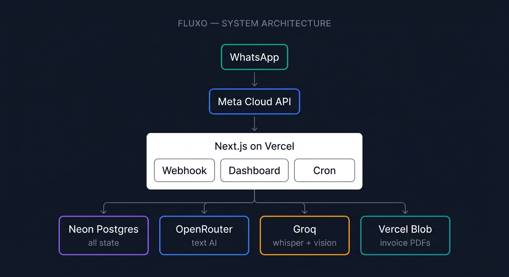
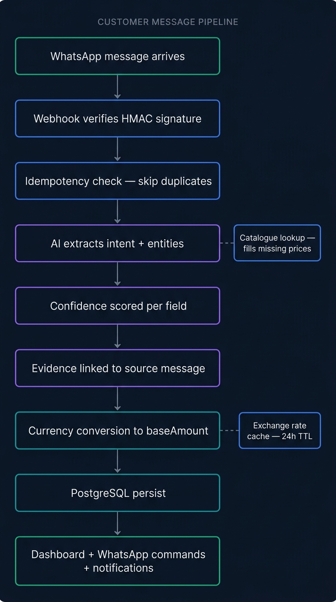
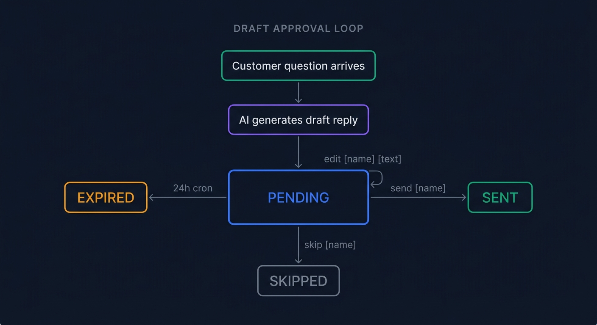
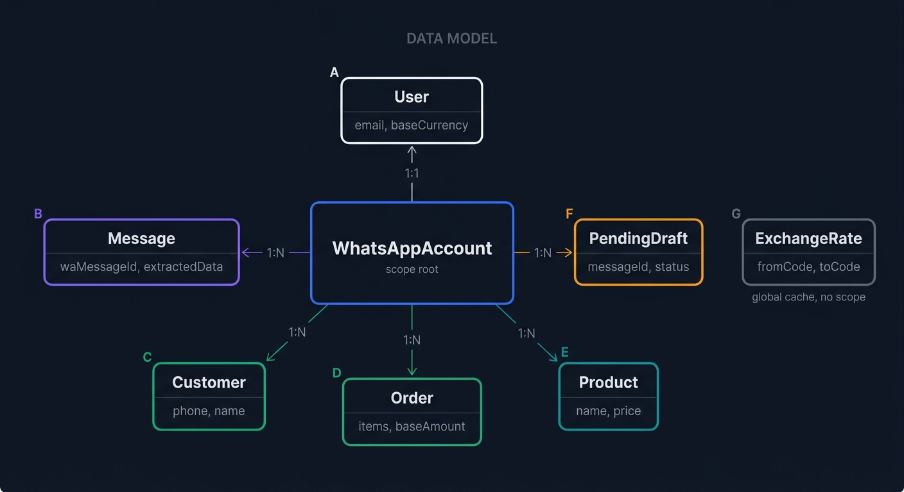

# Fluxo — Architecture

This document describes how Fluxo is built: the pipeline, the data model, and the decisions behind them. Read it alongside the [README](./README.md).

---

## 1. High-level architecture



**Deployment:** Vercel, with Fluid Compute. The webhook function is configured for 300-second execution.

**Database:** Neon Postgres, free tier, kept warm by a cron-job.org ping to `/api/health` every 4 minutes.

**Model strategy:** Text uses OpenRouter with runtime model discovery (self-healing against slug retirement). Voice and vision use Groq, which has more stable free tiers for those modalities.

---

## 2. The AI pipeline

### 2.1 Message ingestion

Every inbound WhatsApp message arrives at `/api/whatsapp/webhook` with an `x-hub-signature-256` header. The route:

1. Verifies the HMAC signature using `WHATSAPP_APP_SECRET`
2. Idempotently stores the message (`waMessageId` is unique — Meta retries get deduplicated)
3. Detects whether the sender is the owner (`fromNumber === account.phoneNumber`)
4. Routes by message type

If the sender is the owner and the text looks like a command (`quickCommandCheck` regex), it goes to the command pipeline. Otherwise, it goes to the extraction pipeline.

### 2.2 Customer message pipeline



| Step | What happens |
|---|---|
| 1 | Text message arrives at the webhook |
| 2 | Build context: business name, base currency, phone country code, catalogue summary |
| 3 | `extractMessage()` calls OpenRouter in JSON mode |
| 4 | Returns an `ExtractedMessage` object: intent, confidence, language, customer, order details, question, complaint |
| 5 | Persist the extracted data on the `Message` row |
| 6 | If intent is `order` with confidence ≥ 0.7, continue. Otherwise, stop here. |
| 7 | Find or create the `Customer` by phone number |
| 8 | Catalogue lookup: for each item with no price, fuzzy-match against the `Product` table and fill in prices |
| 9 | Recompute `total` from `sum(quantity × price)` if the extractor didn't provide one |
| 10 | Currency conversion: convert to base currency, store `originalAmount`, `originalCurrency`, `baseAmount`, `exchangeRate`, `exchangeRateDate` |
| 11 | Parse `scheduled_at` into a real timestamp |
| 12 | Create the `Order` row |
| 13 | Fire `notifyHighValueOrder()` if the base amount crosses the seller's threshold |
| 14 | Fire `notifyIncomingMessage()` if the owner has alerts enabled |
| 15 | If intent is `question` and draft notifications are on, fire `notifyOwnerWithDraft()` → `generateDraftReply()` → ping owner |

### 2.3 Voice pipeline

| Step | What happens |
|---|---|
| 1 | Audio message arrives at the webhook |
| 2 | Download media from Meta: `media ID → temporary URL → bytes` |
| 3 | Send audio to Groq Whisper (`large-v3-turbo`) with a prompt hint to prefer Roman/Latin script over Devanagari |
| 4 | Store the transcription as `Message.content` with a `[voice]` prefix |
| 5 | Run the same `extractInBackground()` path as text |

### 2.4 Image pipeline

| Step | What happens |
|---|---|
| 1 | Image message arrives at the webhook |
| 2 | Download media from Meta |
| 3 | Encode as a base64 data URL |
| 4 | Send to Groq vision (`Qwen3.8-27b`) with a JSON-constrained prompt |
| 5 | Return an `Analysis` object: image type (`payment_screenshot`, `product_photo`, `delivery_proof`), payment details, text in image |
| 6 | Store `imageAnalysis` on the `Message` row |
| 7 | If `imageType === "payment_screenshot"` with confidence ≥ 0.7, find the customer, find their latest unpaid order, and mark it paid |

### 2.5 Owner command pipeline

| Step | What happens |
|---|---|
| 1 | Owner types a message into WhatsApp |
| 2 | `quickCommandCheck()` runs a fast regex match against known command patterns |
| 3 | If it matches, `parseCommand()` calls OpenRouter in JSON mode |
| 4 | Returns a `ParsedCommand`: intent (one of ~20 values), confidence, params (`customer_name`, `status`, `query`) |
| 5 | Deterministic executor switches on the intent |
| 6 | Command runs: `summary`, `list_pending`, `list_unpaid`, `list_repeat`, `weekly_report`, `mark_shipped`, `mark_delivered`, `cancel`, `mark_paid`, `invoice`, `remind`, `remind_one`, `send_draft`, `edit_draft`, `skip_draft`, `list_drafts`, `list_products`, `search`, `help` |
| 7 | Format the reply and send it via Meta Cloud API |

Every command is a pure function of the parsed intent and the database state. **The AI never decides what to do — it only describes what the owner wants. Code decides what happens.**

### 2.6 Draft approval loop



| Step | What happens |
|---|---|
| 1 | Customer sends a question |
| 2 | `generateDraftReply()` builds context: business, tone (past outgoing messages), customer orders, catalogue |
| 3 | Store the draft on `Message.draftReply` and create a `PendingDraft` row |
| 4 | Ping the owner with a short preview and three available commands |
| 5 | Owner replies with one of three commands |
| 6a | `send [name]` → `approveAndSendDraft()` → sends to customer via WhatsApp |
| 6b | `edit [name] [text]` → `editDraftText()` → re-pings for confirmation |
| 6c | `skip [name]` → `skipDraft()` → status set to `skipped` |
| 7 | Cron at 00:00 UTC expires stale pending drafts (24h TTL) |

---

## 3. Data model



Nine Prisma models. The schema lives at `prisma/schema.prisma`.

### User
The business owner. Holds settings (`baseCurrency`, `draftNotifications`, `notifyIncomingMessages`, `highValueThreshold`), business metadata (`businessName`, `businessType`), and Auth.js fields.

### Account, Session, VerificationToken
Standard Auth.js v5 tables.

### WhatsAppAccount
One per User. Stores `phoneNumber`, `phoneNumberId`, `wabaId`, `displayName`. Every message, customer, order, product, and pending draft is scoped through this row.

### Message
The raw log of every inbound and outbound message. Contains:
- `rawPayload` — the full Meta webhook body, kept for audit
- `extractedData` — the JSON returned by the extractor
- `imageAnalysis` — the JSON returned by the vision model
- `draftReply` — the last AI-generated draft for this message

### Customer
Unique per `(whatsappAccountId, phone)`. Names get filled in when the extractor finds them; the phone number is always the identity.

### Order
The structured unit of business. Contains items (JSONB), total, currency, payment method, payment status, delivery status, `recipientName` (from the AI — different from the phone owner), `scheduledAt`, `lastRemindedAt`, and the full currency-conversion set (`originalAmount`, `originalCurrency`, `baseAmount`, `exchangeRate`, `exchangeRateDate`).

### Product and ProductVariant
The seller's catalogue. A Product has a base price. Optional ProductVariants (size, colour, weight) carry their own prices and optional stock.

### PendingDraft
The state machine for the AI-draft approval loop. `status` is `pending`, `sent`, `skipped`, or `expired`. `expiresAt` is set to creation + 24h.

### ExchangeRate
A simple key-value cache: `fromCode → toCode → rate`, refreshed once per day from exchangerate-api.com with USD as the pivot currency.

---

## 4. Key design decisions

### 4.1 AI interprets, code executes

The AI's output is always **data**, never executable. Extraction returns a JSON object with a strict shape. The command parser returns an intent and params. Every downstream effect is applied by deterministic TypeScript code with explicit validation.

**Why:** LLMs hallucinate. Deterministic code doesn't. If the AI says "mark delivered" for a customer that doesn't exist, the code returns "no customer found" — it doesn't invent a customer. Every business action is auditable and reproducible.

### 4.2 Idempotency everywhere

Meta retries slow webhooks. Fluxo's webhook stores a `waMessageId` uniqueness constraint. If a retry arrives, the second insert fails silently and the route returns 200. This prevents duplicate orders and duplicate sends.

### 4.3 Background processing

The webhook response is decoupled from the AI work. The 200 is returned as soon as the message is stored, and processing continues after. On Vercel, unawaited promises die with the function, so the code `await`s long-running work and the function is configured with a 300-second `maxDuration`.

### 4.4 Runtime model discovery

Hardcoded model slugs go stale. OpenRouter retires free models without notice. Fluxo fetches the current free-model list at runtime (`lib/ai/openrouter-models.ts`), filters for JSON-mode-capable text models with sufficient context, caches the result for 24 hours, and falls back to a hardcoded safe list if discovery fails.

**Why:** Self-healing against provider churn. The alternative is a code change every time a slug retires.

### 4.5 Currency normalization

Every order stores both its original currency (what the customer said) and a base-currency equivalent (what the seller thinks in). All sums in the dashboard, reports, and commands use `baseAmount` — never raw `total`. Orders whose conversion failed are excluded from sums and counted separately, so nothing is silently dropped.

### 4.6 The customer is a phone number, not a name

Customers are uniquely identified by `(whatsappAccountId, phone)`. Names are mutable metadata. This matches how the real world works: "Sara" and "Sara Baji" from the same number are the same customer. The AI-extracted name is stored separately on the Order as `recipientName` to preserve the distinction between "who ordered" and "who is being sent to".

### 4.7 Serverless-first, local-dev second

Everything runs on Vercel. There's no self-hosted server. Development happens locally against the same Neon database, with ngrok as the webhook tunnel. When a feature ships, it ships to production, and the demo can be recorded from any device without a laptop being on.

---

## 5. Security and reliability

### Signature verification
Every webhook POST is signed by Meta. Fluxo verifies the HMAC SHA-256 using `WHATSAPP_APP_SECRET` before parsing the body. Unsigned requests get 403.

### Idempotency
`Message.waMessageId` is unique. Duplicate webhooks are dropped silently. The same applies to `PendingDraft.messageId`, so a draft can't be approved twice.

### Scoped queries
Every Prisma query from the dashboard and API is scoped by `whatsappAccountId` derived from the logged-in user. A user cannot read or modify another account's data even if they know an ID.

### Failure recovery

| Scenario | What happens |
|---|---|
| Vision model fails | Image is stored, `imageAnalysis` is null, nothing else runs |
| Extraction fails | Message is stored, `extractedData` is null, raw payload preserved for retry |
| Draft generation fails | Owner gets no ping, message still shows on the dashboard |
| Send fails (Meta `#131030`) | Failure is logged, pending draft stays `pending`, owner can retry |
| Neon is asleep | Health check cron keeps it warm; cold start costs ~5-10s but never fails permanently |

### No secrets in the client
Every credential (`WHATSAPP_ACCESS_TOKEN`, `OPENROUTER_API_KEY`, etc.) is server-only. No API route returns them. The client only ever sees derived data.

---

## 6. Known limitations

- **Vercel Hobby tier** caps function execution at 300 seconds with Fluid Compute. A cold Neon start plus two sequential AI calls can approach this limit for very complex messages.
- **Free AI models** are rate-limited. Multiple messages in the same minute can exhaust the shared pool. The runtime discovery layer retries the next candidate, but there's no paid fallback, so occasionally a draft or extraction will fail.
- **Free OpenRouter models** occasionally return safety meta-comments like "User Safety: safe". These are filtered and treated as failures; the next model in the list is tried.
- **The Meta test number** has a 5-recipient whitelist. Production numbers don't.
- **No auto-send.** Every AI-drafted reply requires an owner approval via `send [name]`. This is intentional — it's the trust boundary.

---

## 7. Repository layout

```
fluxo/
  app/
    api/
      account/         user settings endpoints
      auth/            Auth.js routes
      cron/            scheduled jobs (weekly report, draft expiry)
      messages/        AI-draft endpoints
      orders/          order status endpoint
      products/        catalogue CRUD
      signup/          credential signup
      whatsapp/        webhook, connect, media
    dashboard/         11 pages (overview, orders, customers, ...)
    onboarding/        2-step wizard
    setup-guide/       public WhatsApp setup walkthrough
    login/  signup/    auth pages
    page.tsx           landing page

  lib/
    ai/                client, prompts, extract, draft-reply,
                       commands, vision, transcribe, models
    currency/          convert
    invoice/           template, generate
    products/          queries, lookup, catalogue-context
    reports/           weekly
    whatsapp/          send, media, drafts, reminders,
                       notify-draft, notify-incoming, notify-high-value
    prisma.ts          shared client

  prisma/
    schema.prisma
    migrations/

  public/screenshots/
  auth.ts
  vercel.json
  package.json
```

## 8. Further reading

- The runtime model discovery: `lib/ai/openrouter-models.ts`
- The extractor prompt: `lib/ai/prompts.ts`
- The command parser prompt: `lib/ai/command-prompts.ts`
- The drafting prompt: `lib/ai/draft-reply.ts`
- The webhook (the entry point): `app/api/whatsapp/webhook/route.ts`
- The data model: `prisma/schema.prisma`

