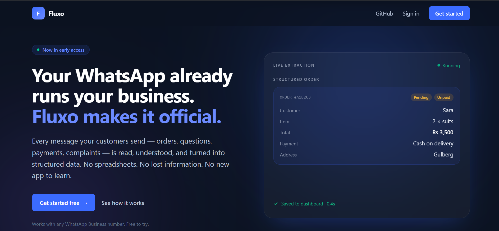
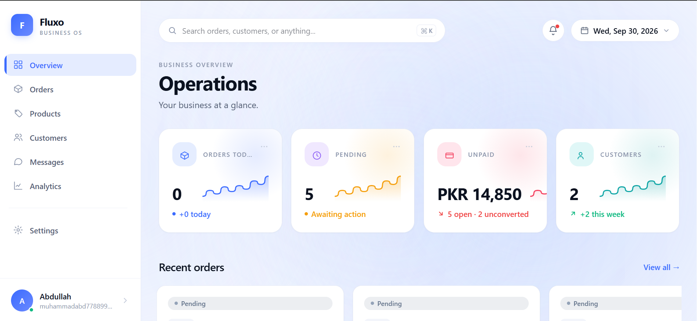
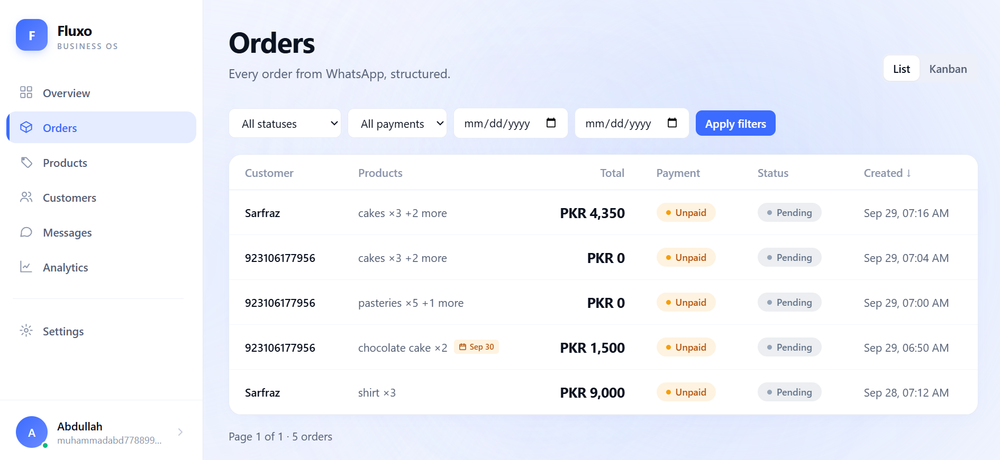
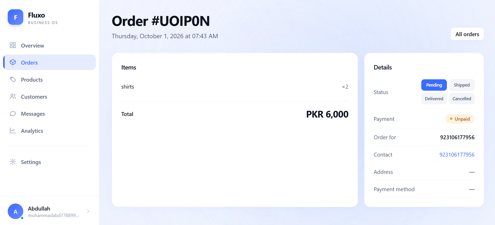
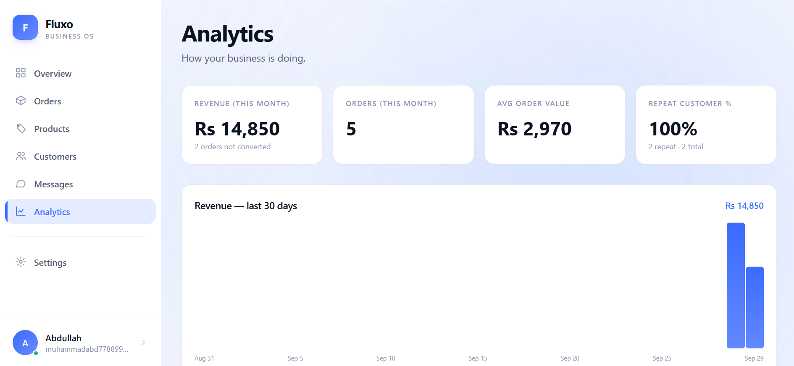
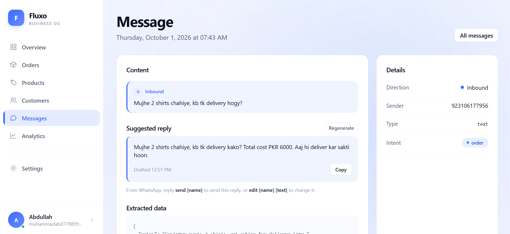
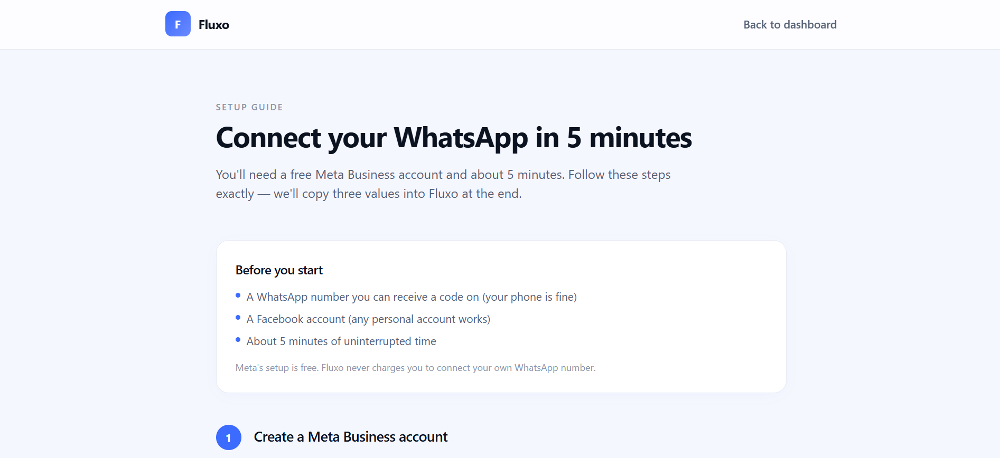
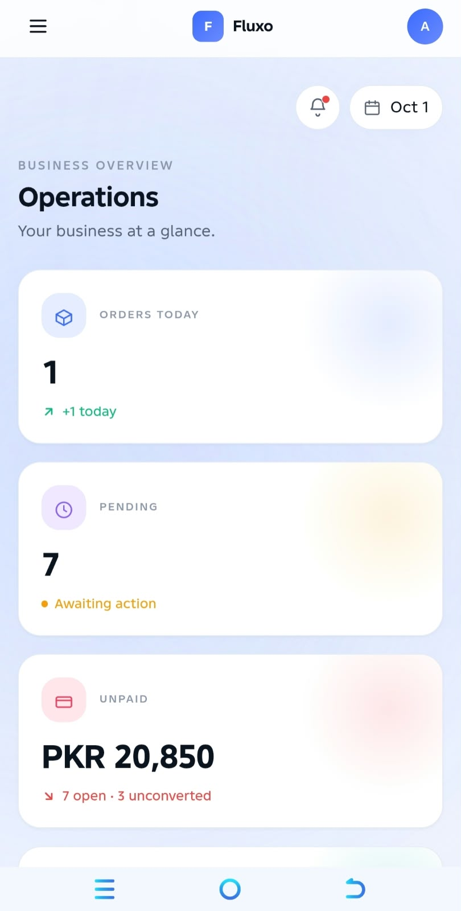
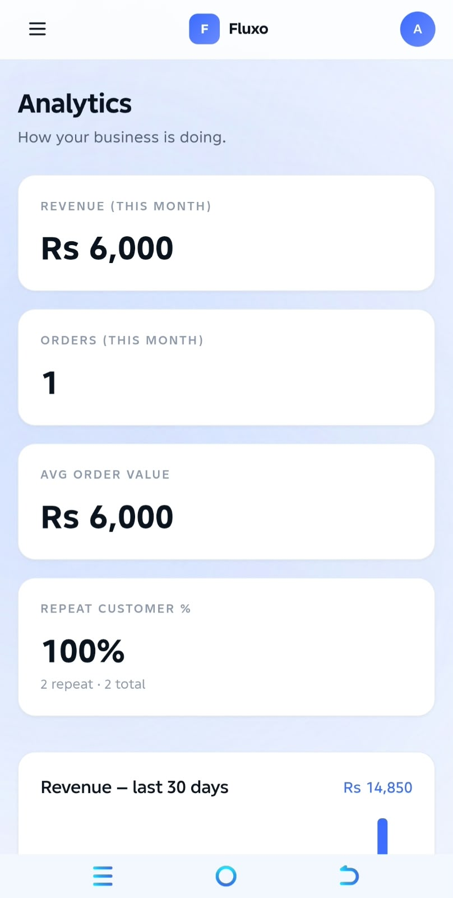

# Fluxo — The WhatsApp Business OS

**Your WhatsApp already runs your business. Fluxo makes it official.**

Fluxo is a business operating system that lives inside WhatsApp. Sellers keep using WhatsApp exactly as they do today. Behind the scenes, Fluxo reads every message, extracts the business meaning, and turns unstructured conversations into structured orders, customers, and payments.

It's not a chatbot. It's not an auto-reply tool. It's the operating system for WhatsApp-first businesses.



---

## The problem

Millions of small businesses run on WhatsApp. Orders tracked in memory. Prices remembered instead of stored. Payments chased over chat. Customers asking *"where is my order"* because nobody wrote it down.

WhatsApp was never built to run a business. But it's where the customers are. Fluxo closes that gap.

---

## What Fluxo does

A customer sends a message. Fluxo reads it, understands it, and structures it — without the seller lifting a finger.

**Text order → structured order**

Sara k liye 2 suits, 3,500, COD, Gulberg
becomes
Customer: Sara
Items: 2 × suits
Total: Rs 3,500
Payment: Cash on delivery
Address: Gulberg


**Voice note → order**

A customer records a voice note. Fluxo transcribes it with Groq Whisper, then runs the same extraction pipeline. The order appears on the dashboard in seconds.

**Payment screenshot → order marked paid**

A customer sends a screenshot of their payment. Fluxo reads it with a vision model, extracts the amount and method, and marks the matching unpaid order as paid. No human in the loop.

**Question → AI-drafted reply**

A customer asks *"aap ke pass drinks bhi hoti hain?"*. Fluxo drafts a reply in the seller's voice, using the real prices from their product catalogue, and pings the owner on WhatsApp. The owner approves with one command:


send Sara


The customer gets the reply. The seller never had to type it.

---

## Features

### Extract
- **Structured orders** — every order arrives with customer, items, quantity, price, address, and payment method
- **Multi-modal input** — text, voice notes, and payment screenshots all become structured data
- **Multi-language** — English, Roman Urdu, Roman Hindi, and mixed input handled the same way
- **Catalogue-aware pricing** — quotes real prices from the seller's product catalogue, never invents them
- **Confidence scoring** — every field is scored; every extraction is traceable to its source message
- **Scheduled delivery** — "kal subah 10 baje" becomes a real timestamp on the order

### Operate
- **Natural language commands** — the seller runs their business by typing in WhatsApp
- **Invoice PDFs** — send a PDF invoice to any customer with one command
- **Payment reminders** — chase every unpaid customer with `remind all`
- **AI-drafted replies** — approve or edit drafts without leaving WhatsApp
- **High-value order alerts** — automatic pings for orders above the seller's threshold

### Understand
- **Real dashboard** — every order, customer, and message in one place
- **Analytics** — revenue trends, top products, top customers, repeat detection
- **Weekly reports** — sent to the seller's phone every Monday morning
- **Product catalogue** — with variants (size, colour, weight, flavour)

---

## Commands

Everything the seller needs runs from WhatsApp. Just type what you want.

| Command | What it does |
|---|---|
| `summary` | Today's business at a glance |
| `pending` | Orders still waiting to ship |
| `who owes me` | Every unpaid customer |
| `products` | List the product catalogue |
| `shipped [name]` | Mark an order out for delivery |
| `delivered [name]` | Mark an order delivered |
| `cancel [name]` | Cancel an order |
| `paid [name]` | Mark an order paid |
| `invoice [name]` | Generate and send a PDF invoice |
| `remind all` | Send payment reminders to every unpaid customer |
| `remind [name]` | Remind one customer |
| `drafts` | List pending AI-drafted replies |
| `send [name]` | Approve and send a draft |
| `edit [name] [text]` | Change a pending draft |
| `skip [name]` | Discard a pending draft |
| `repeat customers` | Show the most loyal buyers |
| `weekly report` | Full week stats |
| `search [keyword]` | Find any past conversation |
| `help` | Full command list |

---

## Screenshots

### Dashboard — Overview
Real-time KPIs, recent orders, live activity feed.



### Orders — Kanban
Every order grouped by status: pending, out for delivery, delivered, cancelled.



### Order detail
Items, customer, payment method, scheduled delivery, and status controls.



### Analytics
30-day revenue chart, top products, top customers, and order breakdowns.



### AI-drafted replies
Fluxo drafts a reply in the owner's voice, with the real price from the catalogue. The owner approves with one command.



### Setup guide
A 5-minute walkthrough for connecting a WhatsApp Business number.



### Mobile — Dashboard
The full dashboard works on a phone.



### Mobile — Orders
Every page is mobile-first.



### Sign up
Google OAuth or email/password, then a 2-step onboarding wizard.


---

## How it works

WhatsApp message
↓
Meta Cloud API → Fluxo webhook
↓
AI reads: intent + entities + currency + scheduling
↓
Confidence scored, validated, linked to source
↓
PostgreSQL (persisted)
↓
Dashboard + WhatsApp commands + notifications


**The thesis:** AI interprets. Deterministic code executes. The AI never writes SQL, never generates executable code, and never touches data directly. Its output is validated, scored, and traced back to the source before anything runs.

---

## Tech stack

| Layer | Technology |
|---|---|
| Frontend | Next.js 16, React 19, TypeScript, Tailwind CSS |
| Backend | Next.js API routes (serverless on Vercel) |
| Database | PostgreSQL (Neon), Prisma ORM |
| Auth | Auth.js v5 (credentials + Google OAuth) |
| AI — text | OpenRouter (runtime-discovered free models) |
| AI — voice | Groq Whisper (`large-v3-turbo`) |
| AI — vision | Groq vision (`Qwen3.8-27b`) |
| WhatsApp | Meta Cloud API |
| File storage | Vercel Blob (invoice PDFs) |
| Real-time | Server-Sent Events |
| Hosting | Vercel (with Fluid Compute, 300s functions) |
| Cron | Vercel Cron (weekly report, draft expiry) |

---

## Run locally

### Requirements
- Node.js 20+
- A Neon PostgreSQL database ([free tier](https://neon.tech))
- A Meta WhatsApp Business app ([developer console](https://developers.facebook.com))
- OpenRouter API key ([openrouter.ai](https://openrouter.ai))
- Groq API key ([console.groq.com](https://console.groq.com))

### Setup

```bash
git clone https://github.com/abdullah804-stack/fluxo.git
cd fluxo
npm install

Create a .env file with:
DATABASE_URL="postgresql://..."
AUTH_SECRET="your-random-string"
AUTH_GOOGLE_ID="..."
AUTH_GOOGLE_SECRET="..."
WHATSAPP_ACCESS_TOKEN="..."
WHATSAPP_PHONE_NUMBER_ID="..."
WHATSAPP_BUSINESS_ACCOUNT_ID="..."
WHATSAPP_APP_SECRET="..."
WHATSAPP_VERIFY_TOKEN="fluxo-verify-2026"
OPENROUTER_API_KEY="..."
GROQ_API_KEY="..."
EXCHANGERATE_API_KEY="..."
BLOB_READ_WRITE_TOKEN="..."
CRON_SECRET="..."

Run migrations and start:

npx prisma migrate deploy
npx prisma generate
npm run dev

Open http://localhost:3000.

For WhatsApp integration during development, expose your local server with ngrok and point Meta's webhook at https://your-ngrok-url.ngrok-free.app/api/whatsapp/webhook. See the in-app setup guide at /setup-guide for the full walkthrough.

Architecture
The full architecture, data model, and design decisions are documented in ARCHITECTURE.md.

Roadmap
Embedded Signup — one-click WhatsApp connection via Meta's popup flow (requires Meta Tech Provider approval)

Multi-user / team — invite staff with role-based access

Public API — webhooks and REST endpoints for integrations

Auto-reply — send price quotes without owner approval, when confidence is high

Stock tracking — deduct inventory on order creation

License
MIT

Contact
Built by Muhammad Abdullah.

For questions, feedback, or a demo: muhammadabd778899@gmail.com


